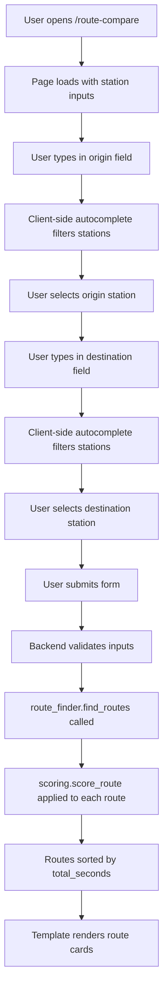
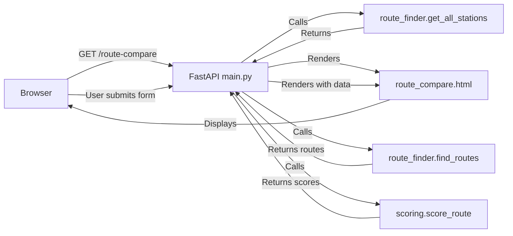

# Design Document

## Overview

This design enhances the Japan Route Optimizer to support dynamic route finding between any two stations in the Tokyo train network. The current implementation already has most of the necessary infrastructure in place - the route_finder module can find routes between arbitrary stations, and the scoring system evaluates route quality. This design focuses on improving the user interface and API to make station selection more intuitive and responsive.

The key enhancement is replacing the current basic datalist-based autocomplete with a more robust client-side autocomplete implementation that provides better user experience, faster response times, and clearer station identification.

## Architecture

### High-Level Flow



### Component Interaction



## Components and Interfaces

### 1. Frontend Components

#### Station Autocomplete Component
- **Location**: Embedded in route_compare.html
- **Technology**: Vanilla JavaScript with CSS
- **Functionality**:
  - Loads all stations on page load via inline JSON
  - Filters stations as user types (case-insensitive, matches English and Japanese)
  - Displays dropdown with matching stations
  - Handles keyboard navigation (arrow keys, enter, escape)
  - Handles click selection
  - Clears results when input loses focus

**Interface**:
```javascript
// Station data structure
{
  stations: [
    {
      id: "station-key",
      name_en: "Shibuya",
      name_ja: "渋谷"
    },
    ...
  ]
}

// Autocomplete functions
function filterStations(query, stations) -> Array<Station>
function showAutocomplete(matches, inputElement)
function hideAutocomplete()
function selectStation(station, inputElement)
```

#### Route Display Component
- **Location**: route_compare.html (existing, minimal changes)
- **Functionality**: Displays route cards with segments and scores
- **Changes**: None required - existing implementation already handles dynamic routes

### 2. Backend Components

#### Route Comparison Endpoint
- **Location**: main.py - `/route-compare` endpoint
- **Current State**: Already supports dynamic origin/destination parameters
- **Changes Required**: 
  - Enhanced input validation
  - Better error messages
  - Station normalization before passing to route_finder

**Interface**:
```python
@app.get("/route-compare")
def route_compare_page(
    request: Request,
    origin: str | None = None,
    destination: str | None = None
) -> TemplateResponse
```

#### Station Data Endpoint
- **Location**: main.py - `/api/network-stations` endpoint
- **Current State**: Returns list of station names
- **Changes Required**: Return structured data with English and Japanese names

**Interface**:
```python
@app.get('/api/network-stations')
def network_stations() -> Dict[str, List[Dict[str, str]]]
# Returns: {
#   "stations": [
#     {"id": "shibuya", "name_en": "Shibuya", "name_ja": "渋谷"},
#     ...
#   ]
# }
```

#### Route Finder Module
- **Location**: route_finder.py
- **Current State**: Already supports finding routes between any two stations
- **Changes Required**: None - existing implementation is sufficient

#### Scoring Module
- **Location**: scoring.py
- **Current State**: Already scores routes with transfer penalties
- **Changes Required**: None - existing implementation is sufficient

## Data Models

### Station Model
```python
{
    "id": str,           # Normalized station key (e.g., "shibuya")
    "name_en": str,      # English name (e.g., "Shibuya")
    "name_ja": str       # Japanese name (e.g., "渋谷")
}
```

### Route Model (Existing)
```python
{
    "name": str,         # Route description
    "segments": [        # List of ride and transfer segments
        {
            "type": "ride" | "transfer",
            "from_station": str,
            "to_station": str,
            "line": str,
            "duration_seconds": int,
            "is_transfer": bool,
            ...
        }
    ]
}
```

### Score Model (Existing)
```python
{
    "total_seconds": int,
    "segments": [
        {
            "base": int,
            "transfer_penalty": int,
            "hell_penalty": int,
            "same_company_bonus": int,
            "total": int
        }
    ]
}
```

## Error Handling

### Input Validation Errors

1. **Missing Origin or Destination**
   - Detection: Check if origin or destination is None or empty string
   - Response: Display form with error message "Please enter both origin and destination"
   - HTTP Status: 200 (render page with error)

2. **Station Not Found**
   - Detection: route_finder._find_station returns None
   - Response: Display error message "Station '[name]' not found. Please select from the suggestions."
   - HTTP Status: 200 (render page with error)

3. **Same Origin and Destination**
   - Detection: Normalized origin equals normalized destination
   - Response: Display error message "Origin and destination must be different stations"
   - HTTP Status: 200 (render page with error)

### Route Finding Errors

1. **No Routes Found**
   - Detection: route_finder.find_routes returns empty list
   - Response: Display "No routes found between [origin] and [destination]"
   - HTTP Status: 200 (render page with message)

2. **Network Data Missing**
   - Detection: network.json file doesn't exist
   - Response: Display error message "Route data not available. Please contact support."
   - HTTP Status: 500

### Frontend Errors

1. **Failed to Load Stations**
   - Detection: JavaScript fails to parse station data
   - Response: Fallback to basic text input without autocomplete
   - User Message: None (graceful degradation)

2. **Network Error on Form Submit**
   - Detection: Form submission fails
   - Response: Browser default error handling
   - User Message: Browser default

## Testing Strategy

### Unit Tests

1. **Station Normalization**
   - Test: Various station name formats normalize correctly
   - Module: route_finder._normalize_station
   - Cases: 
     - "Shibuya" -> "shibuya"
     - "Tōkyō" -> "tokyo"
     - "Shin-Ōkubo" -> "shin-okubo"

2. **Station Finding**
   - Test: Partial and full name matching works
   - Module: route_finder._find_station
   - Cases:
     - Exact match: "shibuya" finds "shibuya"
     - Partial match: "shib" finds "shibuya"
     - Case insensitive: "SHIBUYA" finds "shibuya"

3. **Input Validation**
   - Test: Invalid inputs are caught
   - Module: main.route_compare_page
   - Cases:
     - Empty origin
     - Empty destination
     - Same origin and destination
     - Non-existent station

### Integration Tests

1. **End-to-End Route Finding**
   - Test: Complete flow from station selection to route display
   - Endpoint: GET /route-compare?origin=Shibuya&destination=Tokorozawa
   - Verify: Routes are returned and scored correctly

2. **Station API**
   - Test: Station data endpoint returns correct format
   - Endpoint: GET /api/network-stations
   - Verify: Returns list of stations with id, name_en, name_ja

3. **Error Handling**
   - Test: Invalid inputs return appropriate errors
   - Cases:
     - Missing parameters
     - Invalid station names
     - Same origin/destination

### Frontend Tests

1. **Autocomplete Filtering**
   - Test: Typing filters stations correctly
   - Cases:
     - English name matching
     - Japanese name matching
     - Case insensitive matching
     - Partial matching

2. **Keyboard Navigation**
   - Test: Arrow keys and enter work correctly
   - Cases:
     - Arrow down selects next
     - Arrow up selects previous
     - Enter confirms selection
     - Escape closes dropdown

3. **Form Submission**
   - Test: Form submits with selected stations
   - Verify: URL parameters are correct

## Implementation Notes

### Station Data Enhancement

The current `get_all_stations()` function returns a simple list of station names. We need to enhance this to return structured data with both English and Japanese names. The data is available in the network.json file where stations are stored with their display names.

### Autocomplete Implementation Strategy

Rather than using the HTML5 datalist (which has limited styling and UX), we'll implement a custom autocomplete using:
- JavaScript for filtering and interaction
- CSS for styling the dropdown
- Event listeners for keyboard navigation
- Debouncing for performance (if needed)

### Backward Compatibility

The existing `/route-compare` endpoint already accepts origin and destination parameters, so no breaking changes are required. The enhancement is purely additive.

### Performance Considerations

1. **Station Loading**: Load all stations once on page load (typically <100 stations, minimal data)
2. **Filtering**: Client-side filtering is fast enough for this dataset size
3. **Route Finding**: Already optimized in route_finder module with BFS and caching

### Accessibility Considerations

1. **Keyboard Navigation**: Full keyboard support for autocomplete
2. **ARIA Labels**: Add appropriate ARIA attributes for screen readers
3. **Focus Management**: Proper focus handling for dropdown
4. **Error Messages**: Clear, descriptive error messages

## Design Decisions and Rationales

### Decision 1: Client-Side Autocomplete vs Server-Side

**Choice**: Client-side autocomplete with all stations loaded on page load

**Rationale**:
- Station list is small (<100 stations)
- Eliminates network latency for each keystroke
- Simpler implementation
- Better user experience with instant feedback

**Alternatives Considered**:
- Server-side autocomplete with AJAX calls: Adds unnecessary complexity and latency

### Decision 2: Vanilla JavaScript vs Framework

**Choice**: Vanilla JavaScript for autocomplete

**Rationale**:
- No build step required
- Minimal code footprint
- Sufficient for this use case
- Consistent with existing codebase (no frameworks currently used)

**Alternatives Considered**:
- React/Vue component: Overkill for this feature
- jQuery: Unnecessary dependency

### Decision 3: Enhance Existing Endpoint vs New Endpoint

**Choice**: Enhance existing `/route-compare` endpoint

**Rationale**:
- Endpoint already supports dynamic parameters
- No breaking changes
- Simpler architecture
- Maintains RESTful design

**Alternatives Considered**:
- New `/api/find-routes` endpoint: Unnecessary duplication

### Decision 4: Station Data Format

**Choice**: Return structured objects with id, name_en, name_ja

**Rationale**:
- Supports bilingual display
- Enables better matching (search both languages)
- Provides normalized ID for form submission
- Future-proof for additional metadata

**Alternatives Considered**:
- Simple string list: Insufficient for bilingual support
- Full station objects with all metadata: Unnecessary data transfer

## Security Considerations

1. **Input Sanitization**: Station names are validated against known stations before processing
2. **SQL Injection**: Not applicable (no SQL database)
3. **XSS Prevention**: Jinja2 auto-escapes template variables
4. **CSRF**: Not required for GET requests
5. **Rate Limiting**: Consider adding if abuse becomes an issue

## Future Enhancements

1. **Recent Searches**: Store recent origin/destination pairs in localStorage
2. **Favorite Routes**: Allow users to save frequently used routes
3. **Geolocation**: Auto-detect nearest station
4. **Real-time Data**: Integrate with live train APIs for delays
5. **Mobile App**: Native mobile interface
6. **Multi-language Support**: Add more language options beyond English/Japanese
